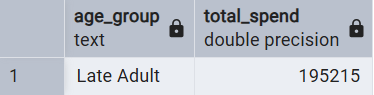
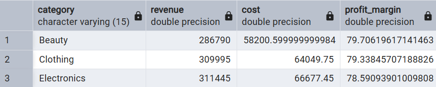
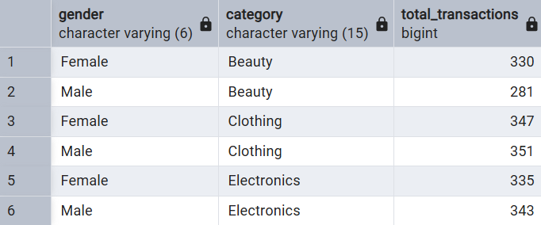
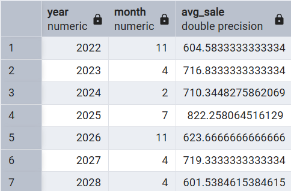
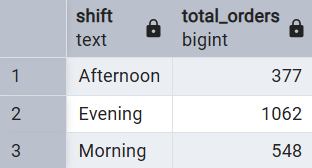

# Retail Sales Analysis
# Exploratory Data Analysis using SQL (PostgreSQL)
#   - A SQL-based data analysis project exploring retail transaction data to uncover sales trends, customer behavior, and category performance.

<<<<<<< HEAD
# Columns: transaction_id, sale_date, sale_time, customer_id, gender, age, category, quantity, price_per_unit, cogs, total_sale

# Some Analysis I explored
#   1.) -- Which age group spends the most?

=======

# Columns: transaction_id, sale_date, sale_time, customer_id, gender, age, category, quantity, price_per_unit, cogs, total_sale

# Some Analysis I explored
#   1. Which age group spends the most?

#   2. What is the profit margin by category?

#   3. Find the total number of transactions (transaction_id) made by each gender in each category.

#   4. Best selling month in each year.

#   5. Create each shift and number of orders (Morning <=12, Afternoon Between 12 & 17, Evening >17).

# These are just some of the analyses I explored in this project. Feel free to check out the full SQL file to see everything I worked on!

# SQL Concepts Demonstrated
#   - GROUP BY with aggregate functions (SUM, AVG, COUNT)
#   - CASE WHEN for age group segmentation and shift classification
#   - Window functions — RANK() OVER (PARTITION BY ...)
#   - Common Table Expressions with WITH
#   - Subqueries for filtering ranked results
#   - Date/time extraction using EXTRACT(YEAR ...), EXTRACT(MONTH ...), EXTRACT(HOUR ...)
#   - ORDER BY for sorting results
#   - DISTINCT for unique customer counts
>>>>>>> d9dffb1 (add)
